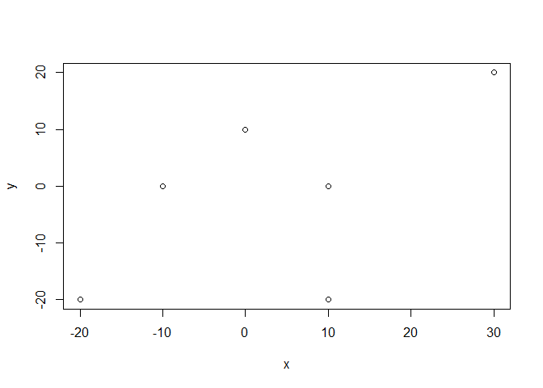
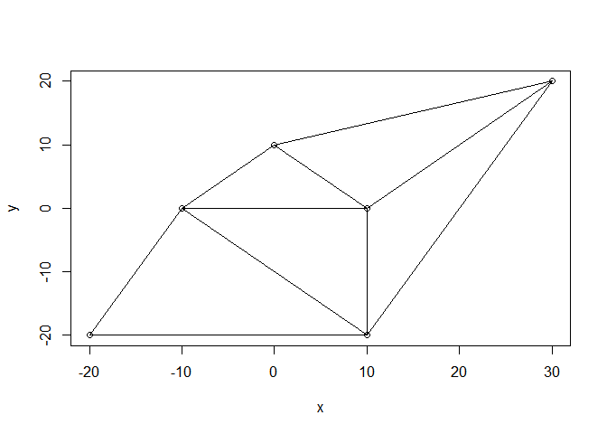
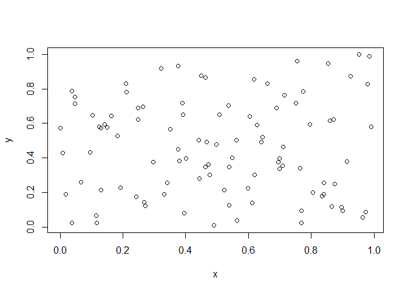
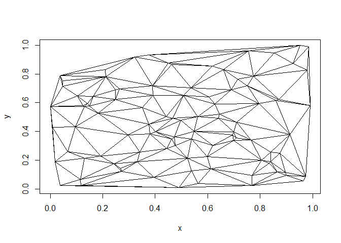

# tRiad

<!-- badges: start -->

[](https://github.com/ZeroDawn0D/triad/actions/workflows/R-CMD-check.yaml)

<!-- badges: end -->

## Overview

tRiad is a package to perform Delaunay Triangulations ([Sloan(1987)](https://www.newcastle.edu.au/__data/assets/pdf_file/0017/22508/13_A-fast-algorithm-for-constructing-Delaunay-triangulations-in-the-plane.pdf)) on a set of 2D points. It was developed as part of GSoC 2022 for the R Project for Statistical Computing. It was developed with the help of my mentors Di Cook and Harriet Mason.

## Installation

``` r
#Development version
#install.packages("devtools")
devtools::install_github("ZeroDawn0D/tRiad")
#> 
#> * checking for file 'C:\Users\umang\AppData\Local\Temp\Rtmpys7ony\remotes6fc066d14581\ZeroDawn0D-tRiad-f606fbb/DESCRIPTION' ... OK
#> * preparing 'triad':
#> * checking DESCRIPTION meta-information ... OK
#> * cleaning src
#> * checking for LF line-endings in source and make files and shell scripts
#> * checking for empty or unneeded directories
#> * building 'triad_0.0.0.9000.tar.gz'
#> 
#> Warning in i.p(...): installation of package 'C:/Users/umang/AppData/Local/Temp/
#> Rtmpys7ony/file6fc05ca84339/triad_0.0.0.9000.tar.gz' had non-zero exit status
```

## Running

``` r
x <- c(0,10,-20,30,10,-10)
y <- c(10,-20,-20,20,0,0)
plot(x,y)
```

<!-- -->

``` r
library(triad)
triad.obj <- DelTri(x,y)
plot(triad.obj)
```

<!-- -->

## Using Data Frames

``` r
data("hundred")
plot(hundred)
```

<!-- -->

``` r
triad.hundred <- DelTri(hundred)
plot(triad.hundred, type = 'n')
```

<!-- -->
