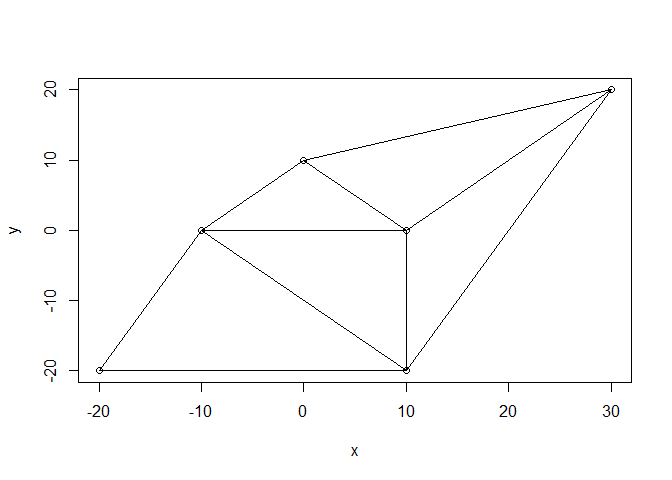

# tRiad

<!-- badges: start -->

[](https://github.com/ZeroDawn0D/triad/actions/workflows/R-CMD-check.yaml)

<!-- badges: end -->

## overview

tRiad is a package to perform Constrained Delaunay Triangulations
([Cline and
Renka(1990)](https://epubs.siam.org/doi/abs/10.1137/0727074)) on a set
of 2D points

## installation

``` r
#Development version
#install.packages("devtools")
devtools::install_github("ZeroDawn0D/tRiad")
```

## Running

``` r
x <- c(0,10,-20,30,10,-10)
y <- c(10,-20,-20,20,0,0)
plot(x,y)
```

<!-- -->

``` r
library(triad)
triad.obj <- del_tri(x,y)
plot(triad.obj)
```

<!-- -->

## Using Data Frames

``` r
data("datasaurus_dozen")
dino <- datasaurus_dozen[datasaurus_dozen$dataset=="dino",]
dino <- data.frame(x=dino$x, y=dino$y)
plot(dino)
```

<!-- -->

``` r
triad.dino <- del_tri(dino)
plot(triad.dino)
```

<!-- -->
